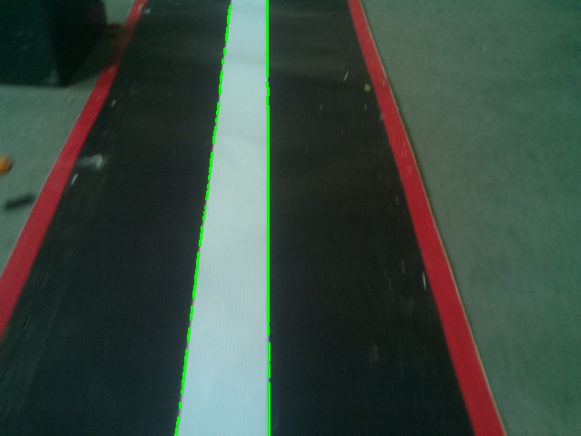

# Line-detection-using-opencv
Line detection algorithm using opencv and python. 

A coloured image is captured.
It is then converted from RGB to Gray (as only 1 bit is used) hence resulting in effective processing.
Then canny edge detection is used to find the edges of the line.
However only canny cannot be relied upon as it depends on the light intensity, and may have noise in most of the cases. Hence the canny and the gray image is combined to form a new image which is used for line detection.
This algorithm searches lane (white lane) in the specified area described in the code.
Centre point of both lines of the lane is calculated using pixel calculations.
And displacement between the center of line and centroid of the bot is calculated.

Backstory :
I developed this during my time at Agnels Robotics Club as Robocon coding team member (in collaboration with 2 other members). 
This is a line detection algorithm which was intended to be used by our autonomous bot (for Robocon 2019).
